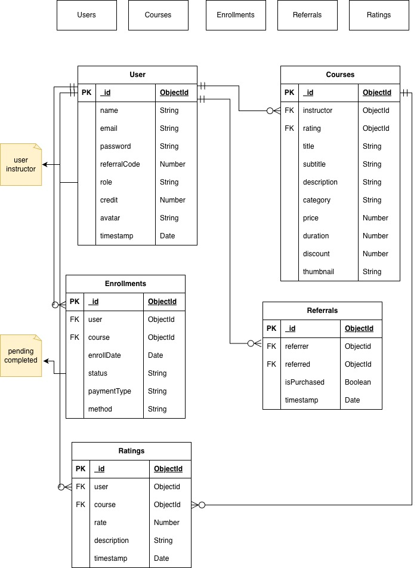
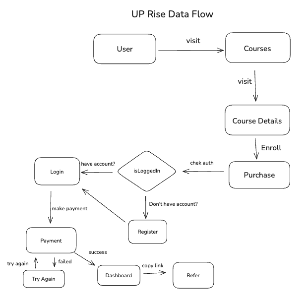

# 🎓 Uprise — An online educational platform

> **Uprise** is a modern online learning and referral platform built [Next.js](https://nextjs.org) bootstrapped with [`create-next-app`](https://nextjs.org/docs/app/api-reference/cli/create-next-app).

---

## 📖 Table of Contents

- [🎓 Uprise — An online educational platform](#-uprise--an-online-educational-platform)
  - [📖 Table of Contents](#-table-of-contents)
  - [🧩 Project Overview](#-project-overview)
  - [✨ Features](#-features)
  - [🛠️ Tech Stack](#️-tech-stack)
  - [🧠 Architecture \& Business Logic](#-architecture--business-logic)
    - [1. Application Architecture](#1-application-architecture)
    - [2. Signup](#2-signup)
    - [3. Credit Rewards](#3-credit-rewards)
  - [🚀 Getting Started](#-getting-started)
    - [Prerequisites](#prerequisites)
    - [Installation](#installation)
    - [Running Locally](#running-locally)
  - [🔐Environment Variables](#environment-variables)
  - [🗃️Test Payment](#️test-payment)
  - [📈ER Diagram](#er-diagram)
  - [📉Data Flow Diagram](#data-flow-diagram)
  - [🔗Live Link](#live-link)

---

## 🧩 Project Overview

> **Uprise** is an online educational platform where people can learn new skills for the making a better feature. With this they can referrer to their friends and family and earn credits online

Here users can:

-   Purchase new courses
-   Refer a friends to earn credits
-   If their friends sign up using the code and make first purchase, both of them will be credited
-   Track referrals progress in their dashboard

---

## ✨ Features

-   Browse and buy courses
-   Student dashboards
-   Built-in referral & rewards system
-   Secure authentication (NextAuth.js / JWT)
-   Payment integration (Stripe)
-   Analytics for referral and purchase tracking
-   Responsive UI for all devices

---

## 🛠️ Tech Stack

**Frontend:** Next.js 14, React, TypeScript, Framer-Motion and Tailwind CSS  
**Backend:** Next.js API Routes,Server Actions, MongoDB and Mongoose
**Auth:** NextAuth.js V5(Beta) (credentials)  
**Payments:** Stripe  
**Deployment:** Vercel

---

## 🧠 Architecture & Business Logic

### 1. Application Architecture

-   The project is **modular, server-first architecture** used **Next.js App Router**. This project mostly used server actions to for data processing.

### 2. Signup

-   User may or may not use referral code while registration
-   If a user used a referral code then server will try to validate if code is valid it will keep the reference with referrer in users table

*   Registration Endpoints
    `http:/localhost:3000/api/registration`

```bash
{

  "name": "name",
  "email": "email@email.com",
  "password": "xxxxxxx",
  "referralCode": "RAJ5T9" // optional
}
```

### 3. Credit Rewards

-   Once a referred user do his/her first purchase
-   -   User will earn 2 credits
-   -   The referrer user will earn 2 credits
-   -   It will works only for first time purchase
-   -   Rest of the purchase no credits will be added

## 🚀 Getting Started

### Prerequisites

-   Node.js `>=18.0.0`
-   npm, or yarn
-   Git

### Installation

```bash
# Clone the repository (HTTPS)
git clone https://github.com/habib610/uprise-nxt.git

#or (SSH)
git clone git@github.com:habib610/uprise-nxt.git

# Go into the project directory
cd uprise-nxt

# Install dependencies
yarn install
# or
npm install
```

### Running Locally

Run the development server:

```bash
npm run dev
# or
yarn dev
```

## 🔐Environment Variables

Setup environment variables in `.env`

```bash
#Base URI
NEXT_PUBLIC_BASE_PROD_URI = <https://yourproduri.com>
NEXT_PUBLIC_BASE_DEV_URI = http://localhost:3000

#Stripe keys
NEXT_PUBLIC_STRIPE_PUBLISH_KEY =<your_stripe_publish_key>
STRIPE_SECRET_KEY =<your_stripe_secret_key>

#MongoDB URI
MONGODB_CONNECTION_URI_DEV  = mongodb://localhost:27017/uprise
MONGODB_CONNECTION_URI_PROD  = <mongodb+srv://yourmongodbserveruri>

#API URI
NEXT_PUBLIC_SITE_URI_DEV = http://localhost:3000/api
NEXT_PUBLIC_SITE_URI_PROD =  <https://yourproduri.com/api>

#Next Auth Secret
AUTH_SECRET=<your_uth_secret_key>

```

## 🗃️Test Payment

```bash
Test cards: 4242 4242 4242 4242 (Visa) — any future expiry, any CVC.
```

## 📈ER Diagram



## 📉Data Flow Diagram



## 🔗Live Link

This application is deployed on vercel visit
[`uprise`](https://uprise-nxt.vercel.app) for the live demo
